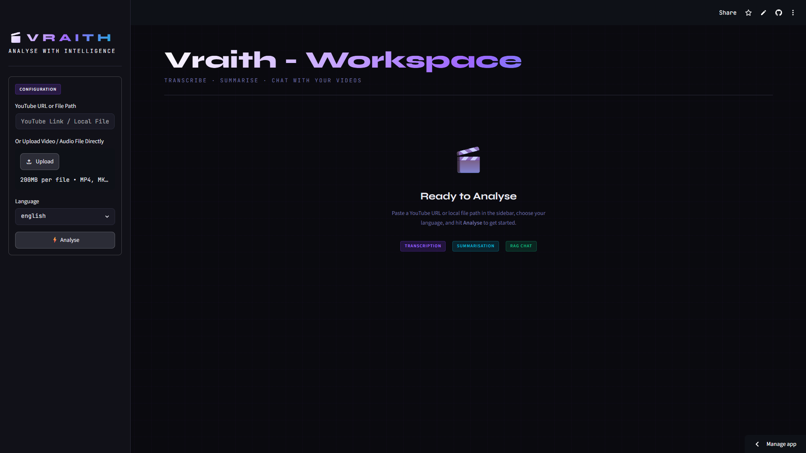

# Vraith


Vraith is an intelligent media analysis assistant powered by Advanced Neural Transcription, LangChain, Retrieval-Augmented Generation (RAG), and Streamlit. It transforms passive unstructured audio and video (from local files or YouTube) into interactive, searchable, and structured knowledge bases. It also automatically summarizes, extracts insights, and enables conversational interaction with the content using RAG.

<p align="center">
  <strong>🎧 Ingest • 🧠 Understand • ✍️ Summarize • 🔍 Extract • 💬 Chat</strong>
</p>

<p align="center">
  <strong>AI-Powered  Intelligence • Media Analysis and Orchestration • Local + Cloud Hybrid Pipeline</strong>
</p>


## Live Demo

https://workingonit.com


## Features

- YouTube video & local file audio ingestion
- Automatic audio extraction & preprocessing
- Advanced Neural Transcription using:
  - OpenAI Whisper (English)
  - Sarvam AI (Bangla / Banglish)
- Intelligent summarization of full conversations
- Action item extraction (with owners & deadlines)
- Key decision detection
- Open question identification
- RAG-based chat over meeting content (ChromaDB + embeddings)
- Interactive Streamlit UI

## UI Preview

### Landing Page



### Generated Result


## Why Vraith?

Most tools only **transcribe** or **translate**.

Vraith as an intelligent media analysis assistant goes further:

- Turns meetings into **structured intelligence**
- Enables **semantic search over conversations**
- Lets you **ask questions like a human assistant**
- Works with both **English + Bangla/Banglish**
- Runs locally with optional AI APIs


## Full Workflow

```text
YouTube URL / Audio File
        ↓
Audio Processor (yt-dlp / ffmpeg)
        ↓
Chunked Audio (pydub)
        ↓
Speech-to-Text (Whisper / Sarvam AI)  <->  Translation (if needed)
        ↓
Summarization (Mistral AI)
        ↓
Insight Extraction
    ├── Action Items
    ├── Key Decisions
    ├── Open Questions
        ↓
Embedding Generation (HuggingFace)
        ↓
Vector Storage (ChromaDB)
        ↓
RAG Chat Engine
        ↓
Streamlit UI / CLI Output
```

## System Architecture

The pipeline follows a synchronous, multi-stage processing architecture. Each layer handles a distinct transformation step, passing the refined data object down the chain until a fully contextualized LangChain RAG object is returned to the frontend.

* Ingestion Layer → Audio extraction from YouTube/Local files
* Processing Layer → Transcription & Translation
* Intelligence Layer → Summarization + Extraction
* Knowledge Layer → Vector DB + Embeddings
* Retrieval Layer → RAG engine
* Presentation Layer → Streamlit UI + CLI


## Architecture Highlights

- Modular service-based architecture
- Clean separation of pipeline stages
- Hybrid local + cloud AI strategy
- RAG-enabled conversational intelligence
- Easily extensible for additional LLMs, embeddings, or vectorDBs

## Project Structure
```
vraith/

apps/
 ├── cli/
 └── streamlit/

src/vraith/
 ├── config/
 ├── chains/
 ├── pipelines/
 ├── prompts/
 ├── services/
 │   ├── audio/
 │   ├── transcription/
 │   ├── summarization/
 │   ├── extraction/
 │   └── rag/
 └── utils/

data/
 ├── downloads/
 ├── uploads/
 └── vectordb/
```

## Prerequisites

- Python 3.12 or higher
- Mistral AI or Any LLM API Key
- FFmpeg installed
- (Optional) CUDA for faster Whisper inference

## Installation

### Clone Repository

```bash
git clone https://github.com/ratul3123/vraith.git
cd vraith
```

### Create Virtual Environment (uv recommended)
using uv:
```bash
uv venv
source .venv/bin/activate
```
or using pip:
```bash
python -m venv .venv
source .venv/bin/activate
```

### Install Dependencies 
uv:
```bash
uv pip install -r requirements.txt
#or 
uv sync
```
or pip:
```bash
pip install -r requirements.txt
```

### Environment Variables
Create .env file:
```bash
cp .env.example .env
```
Add:
```env
MISTRAL_API_KEY = "API_KEY_HERE"
WHISPER_MODEL = "MODEL_NAME" # Default to 'base' if not set
SARVAM_API_KEY = "API_KEY_HERE"
SARVAM_STT_MODEL = "MODEL_NAME"
```

### Run Streamlit App
```bash
streamlit run apps/streamlit/app.py
```


## Tech Stack

| Layer | Technology |
|---------|-----------|
| LLM | Mistral AI |
| Vector Database | ChromaDB |
| Embeddings | HuggingFace Embeddings |
| Orchestration | LangChain (LCEL pipelines) |
| Transcription | OpenAI Whisper (local STT) |
| Translation | Sarvam AI (Bangla/Banglish STT) |
| Frontend / UI | Streamlit, Custom CSS |
| Audio Processing | FFmpeg, yt-dlp |
| Language | Python 3.12 |


## Future Improvements 

- Real-time media capture
- LangGraph-based orchestration
- FastAPI backend for API access
- Parallelized multi-file batch processing
- Multi-language summarization expansion
- Persistent user sessions and database integration
- Exportable chat history and PDF summary reports

## License

Licensed under the MIT License.

## Acknowledgements

- OpenAI Whisper
- LangChain
- HuggingFace
- Mistral AI
- ChromaDB
- Sarvam AI
- yt-dlp community